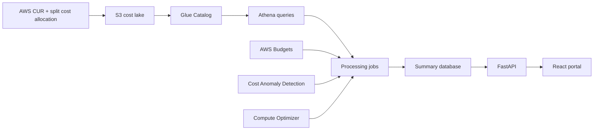

# Architecture

## Logical Components

1. **Frontend**
   - React TypeScript single-page application.
   - Calls REST APIs for dashboard, workflow, and admin data.
   - Falls back to local mock data for local demos.

2. **API Backend**
   - FastAPI routers grouped by domain.
   - Services hold allocation, budget, compliance, and summary logic.
   - Repositories abstract storage. Mock repositories read from `sample-data/`.

3. **Processing Jobs**
   - Athena-backed CUR extraction.
   - EKS split cost allocation label normalization.
   - Direct AWS tag normalization.
   - Shared cost allocation.
   - Budget, anomaly, and Compute Optimizer import jobs.

4. **AWS Infrastructure**
   - S3, Glue, Athena, Lambda, Step Functions, EventBridge, DynamoDB, API Gateway, Cognito/SSO placeholder, CloudFront.

## Data Flow

## Allocation Formula

`Total Tenant Cost = EKS Pod Cost + Direct AWS Service Cost + Allocated Shared Cost`

Each component remains separately queryable for transparency and auditability.
